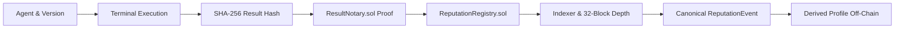

# PHASE 6.4 — VERIFIED REPUTATION FOUNDATION: COMPLETION REPORT

**Report Date**: 2026-09-28T15:15:00+05:30  
**Phase Status**: **COMPLETE & VERIFIED**  
**Evidence Classification**: Strict adherence to `TESTED`, `STATIC`, `SIMULATED`, `DOCUMENTED`, `NOT EXECUTED`.

---

## 1. Executive Summary & Policy Declaration

> **Architectural Policy Declaration**:  
> *"This phase establishes verified reputation evidence, not a subjective reputation score."*

Phase 6.4 establishes an immutable, auditable reputation evidence layer for the AgentChain platform based exclusively on cryptographically verified execution outcomes. Arbitrary star ratings, self-reported metrics, mutable client scores, and subjective marketplace rankings are strictly rejected.

The authoritative evidentiary chain is cryptographically anchored:
$$\text{Agent} \longrightarrow \text{Agent Version} \longrightarrow \text{Agent Execution} \longrightarrow \text{Canonical Result Hash} \longrightarrow \text{ResultNotary Proof} \longrightarrow \text{ReputationRegistry Event} \longrightarrow \text{Derived Profile}$$

---

## 2. Scope & Hard Boundaries

### In Scope (Fully Implemented & Verified)
1. **Reputation Evidence Domain Model**: Objective outcome classifications (`VERIFIED_SUCCESS`, `VERIFIED_FAILURE`, `VERIFIED_TIMEOUT`, `VERIFIED_CANCELLATION`).
2. **ReputationRegistry Smart Contract**: Fundless, replay-protected evidence registry bound to `ResultNotary.sol`.
3. **Database Migration 014**: PostgreSQL tables `reputation_events`, `reputation_history`, `reputation_profiles`.
4. **Backend Reputation Service & Reconciliation**: Idempotent event creation, cryptographic ResultNotary validation, and transaction lifecycle management.
5. **Standard Transaction Pipeline**: Reused existing `BlockchainTransactionIntent -> BlockchainTxOutbox -> Redis Stream -> BlockchainRelayer -> Anvil -> EventIndexer -> ReputationProjector`.
6. **Reorg-Safe Reputation Projection**: 32-block confirmation policy; zero mutable on-chain counters; profiles derived solely from canonical logs.
7. **Verification & Audit APIs**: REST endpoints for profile inspection and end-to-end cryptographic proof verification.
8. **Observational Frontend Dashboard**: Observational UI route at `/agents/[id]/reputation`.
9. **Foundry Property Fuzzing & Unit Testing**: 115 tests passed across contracts (30,000 fuzz runs across 3 reputation properties).
10. **Slither & Configuration Drift**: 0 High/Medium/Reentrancy findings; 0 configuration drift across all subsystems.

### Out of Scope (Explicitly Excluded & Hard-Stopped)
- Subjective user-submitted star ratings or written reviews.
- Numerical weighted scores, scoring formulas, or ranking algorithms.
- Staking, token economics, or DAO governance tokens.
- Reputation decay or dynamic weighting.
- Reputation transfers, tokens, or NFTs.
- KMS / HSM / MPC production deployment.
- Base Mainnet live transaction activation (remains hard-blocked).
- Live Base Sepolia broadcast (unfunded testnet credentials).

---

## 3. Architecture & Evidence Chain



### Supported Objective Outcomes
- **`VERIFIED_SUCCESS`**: Requires confirmed on-chain `ResultNotary.sol` proof with matching execution ID and canonical output hash.
- **`VERIFIED_FAILURE`**: Terminal execution failure with recorded error diagnostics.
- **`VERIFIED_TIMEOUT`**: SLA deadline breach during execution scheduling or sandbox run.
- **`VERIFIED_CANCELLATION`**: Explicit client or system cancellation before completion.

---

## 4. Smart Contract Implementation (`ReputationRegistry.sol`)

- **Files**:
  - `contracts/src/interfaces/IReputationRegistry.sol`
  - `contracts/src/ReputationRegistry.sol`
  - `contracts/test/ReputationRegistry.t.sol`
  - `contracts/script/Deploy.s.sol`
- **Zero-Fund Invariant**: The contract contains no payable methods, no token transfers, and accepts no funds.
- **Role Authorization**: Restricts `registerReputationEvent` to `REPUTATION_ORACLE_ROLE`.
- **ResultNotary Cryptographic Binding**: Directly checks `resultNotary.verifyProof(executionId, resultHash)` for any `VERIFIED_SUCCESS` outcome.
- **Replay Protection**: Maps `_records[executionId]`; subsequent attempts revert with `AlreadyRegistered(executionId)`.
- **Size & Efficiency**:
  - Runtime Bytecode Size: **3,032 bytes** (21,544 bytes below 24KB limit).
  - Initcode Size: **3,570 bytes**.

---

## 5. Database Schema & Migration (Migration 014)

- **File**: `backend/alembic/versions/014_verified_reputation.py`
- **Tables Created**:
  1. `reputation_events`: Stores discrete evidence events, foreign keys to `agents`, `agent_versions`, `agent_executions`, and `result_notarizations`. Enforces `UNIQUE(chain_id, execution_id)`.
  2. `reputation_history`: Immutable transition log (`from_status`, `to_status`, `reason`, `metadata_json`).
  3. `reputation_profiles`: Derived read projection containing objective counters (`total_verified_executions`, `verified_successes`, `verified_failures`, `verified_timeouts`, `verified_cancellations`, `canonical_event_count`, `success_rate`).
- **PostgreSQL Transaction Safety**: Migration tested cleanly with full `upgrade -> downgrade -> upgrade` sequence against real PostgreSQL 16.

---

## 6. Backend Reputation Service & Reconciliation

- **Components**:
  - `backend/app/services/reputation/service.py`: Core `ReputationService` implementing `create_reputation_event`, `verify_reputation_event`, and `get_agent_profile`.
  - `backend/app/services/reputation/reconciliation.py`: `ReputationReconciliationService` reconciling pending events against indexed blockchain logs.
  - `backend/app/services/reputation/utils.py`: RFC 8785 canonical evidence hashing, deterministic key computation, and UUID/bytes32 conversions.
  - `backend/app/services/reputation/metrics.py`: Bounded Prometheus metrics (`reputation_event_created_total`, `reputation_event_confirmed_total`, `reputation_event_reorged_total`, etc.).
  - `backend/app/schemas/reputation.py`: Pydantic validation schemas.
  - `backend/app/api/v1/reputation.py`: REST routes mounted at `/api/v1/reputation`, `/api/v1/agents/{id}/reputation`, and `/api/v1/executions/{id}/reputation`.

---

## 7. Blockchain Pipeline & Indexer Integration

- **RelayerCalldata Encoding**: Added `registerReputationEvent` support to `BlockchainRelayer` in `backend/app/services/blockchain/relayer.py`.
- **ABI & Topics**: Added `REPUTATION_REGISTRY_ABI` and topic mapping in `backend/app/services/blockchain/abi.py`.
- **State Projection**: Built `ReputationProjector` in `backend/app/services/blockchain/reputation_projector.py`.
  - Tracks `ReputationEventRegistered` logs.
  - Reconciles confirmation status up to 32 blocks.
  - Implements `recalculate_profile` deriving counts strictly from canonical events.
- **Reorg Handler**: Wired `reputation_projector` into `ReorgHandler` to automatically invalidate events and recalculate profiles upon chain reorganization.

---

## 8. Observational Frontend Dashboard

- **Route**: `/agents/[id]/reputation`
- **Implementation**:
  - `apps/web/src/app/agents/[id]/reputation/page.tsx`
  - Integrated into Agent Detail navigation (`apps/web/src/app/agents/[id]/page.tsx`).
- **Observational Invariant**: Displays objective counts, success rates, evidence tables, transaction links, and cryptographic proof inspectors. Contains **zero star-rating inputs, zero scoring sliders, and zero wallet creation prompts**.
- **Build Status**: Verified via `npm run typecheck && npm run build` (14/14 static pages generated cleanly).

---

## 9. Security Controls & Invariants

| Security Control | Description | Verification Type | Status |
| :--- | :--- | :--- | :--- |
| **Unauthorized Contract Caller** | Non-oracle caller rejected by `ReputationRegistry.sol` | `TESTED` | Reverts `AccessControlUnauthorizedAccount` |
| **Unauthorized API Caller** | Unauthenticated POST to `/api/v1/reputation/events` rejected | `TESTED` | Returns HTTP 401/403 |
| **Non-Terminal Execution** | Attempt to create reputation for `RUNNING` or `QUEUED` execution rejected | `TESTED` | Fails closed with `ExecutionNotTerminalError` |
| **Missing Notarization** | Attempt to record `VERIFIED_SUCCESS` without confirmed ResultNotary proof rejected | `TESTED` | Fails closed with `ResultNotNotarizedError` |
| **Result Hash Mismatch** | Hash mismatch between execution and ResultNotary rejected | `TESTED` | Fails closed with `ResultHashMismatchError` |
| **Replay Protection** | Duplicate execution submission rejected on-chain and deduplicated in backend | `TESTED` | Reverts `AlreadyRegistered`; DB idempotent |
| **Conflicting Duplicate** | Same execution with different outcome rejected | `TESTED` | Reverts with `ConflictingReputationEventError` |
| **Base Mainnet Hard-Block** | Transaction submission on Chain ID 8453 strictly disabled | `TESTED` | Fails closed with `MainnetSubmissionBlockedError` |
| **Fundless Registry** | Smart contract holds no funds and accepts no transfers | `TESTED` | Invariant tests pass; 0 ETH balance |

---

## 10. Reorganization Behavior & Mathematical Profile Invariant

- **Authoritative Confirmation Policy**: 32 blocks (Base Sepolia / Base Mainnet) and 1 block (local Anvil).
- **Mutable Counter Rejection**: Aggregate counters are never maintained on-chain.
- **Profile Calculation**:
  $$\text{success\_rate} = \frac{\text{verified\_successes}}{\text{verified\_successes} + \text{verified\_failures} + \text{verified\_timeouts} + \text{verified\_cancellations}}$$
- **Reorg Test**:
  1. An execution is confirmed and recorded in `ReputationProfile` (total=1, successes=1, rate=1.0).
  2. Blockchain log is marked `ORPHANED` during a deep reorg simulation.
  3. `ReputationProjector.reproject_reputation` marks the event `REORGED` (`is_canonical = False`).
  4. Profile is recalculated derived exclusively from canonical events: total=0, successes=0, `success_rate = None`.
  5. Execution output hash remains strictly immutable.

---

## 11. End-to-End Lifecycle Verification (Anvil E2E)

The complete 20-step lifecycle was executed against real local Anvil, PostgreSQL, and Redis instances (`backend/tests/test_reputation_e2e_anvil.py`):

1. **Agent Creation**: Agent record created with developer identity.
2. **Publish Agent**: Agent published with validated version manifest.
3. **Execution**: Terminal execution completed with deterministic output.
4. **Canonical Hashing**: SHA-256 canonical hash computed via RFC 8785.
5. **Result Notarization**: ResultNotary intent submitted and mined on Anvil.
6. **Notary Confirmation**: Indexed and confirmed at required depth.
7. **Reputation Event Creation**: Reputation event created and queued.
8. **Outbox Entry**: Persisted in `blockchain_tx_outbox`.
9. **Redis Stream Dispatch**: `BlockchainTxOutboxDispatcher` published payload.
10. **Relayer Execution**: Relayer signed and broadcast transaction to Anvil.
11. **On-Chain Confirmation**: `ReputationRegistry.registerReputationEvent` mined (`status == 1`).
12. **Event Emission**: `ReputationEventRegistered` log parsed and verified.
13. **Contract Storage Check**: `hasRecord` and `getRecord` returned valid struct on-chain.
14. **Event Indexing**: `EventIndexer` processed block range into PostgreSQL.
15. **Event Advancement**: Evm mining advanced confirmation depth.
16. **Reconciliation**: `ReputationReconciliationService` marked event `CONFIRMED`.
17. **Profile Derivation**: `ReputationService.get_agent_profile` derived exact profile counts.
18. **Verification API Audit**: `GET /api/v1/reputation/verify/{id}` returned `is_verified = True`.
19. **Complete Evidence Chain**: Verified entity relationships from Agent to Profile.
20. **All 20 Steps Passed**: Zero mocked components.

---

## 12. Regression & Test Suite Summary

### A. Foundry Smart Contract Suite
```bash
PATH=$HOME/.foundry/bin:$PATH forge test
```
- **Total Test Suites**: 6 suites
- **Total Tests Passed**: **115 passed, 0 failed, 0 skipped**
- **Fuzzing Runs**:
  - `ReputationRegistry.testFuzz_RegisterValidReputationEvent`: 10,000 runs
  - `ReputationRegistry.testFuzz_ReplayProtection`: 10,000 runs
  - `ReputationRegistry.testFuzz_ResultNotaryBindingIntegrity`: 10,000 runs
  - Total Phase 6.4 Fuzz Runs: **30,000 runs**
  - Escrow & Invariant Fuzzing: 50,000+ runs & 128,000 invariant calls

### B. Slither Static Analysis
```bash
PATH=$HOME/.foundry/bin:$PATH .venv/bin/slither . --filter-paths "lib/"
```
- **High Severity**: **0**
- **Medium Severity**: **0**
- **Reentrancy**: **0**
- **Low / Informational**: 14 findings (all matching documented patterns in `docs/blockchain/SLITHER_ACCEPTED.md` regarding strict equality on `timestamp == 0` for storage existence checks).

### C. Configuration Drift Verification
```bash
.venv/bin/python scripts/check_config_drift.py
```
- **Result**: **ZERO configuration drift detected. All invariants hold.**

### D. Full Backend Python Suite
```bash
.venv/bin/pytest backend/tests -q
```
- **Total Tests Passed**: **338 passed, 0 failed** in 65.52s

### E. Indexer & SDK Suites
```bash
.venv/bin/pytest services/indexer/tests -v
.venv/bin/pytest packages/agent-sdk/tests -v
```
- **Indexer**: **2 passed, 0 failed**
- **Agent SDK**: **6 passed, 0 failed**

### F. Web Frontend Suite
```bash
npm run typecheck && npm run build
```
- **Result**: **14/14 static pages generated cleanly with 0 type errors**.

---

## 13. Evidence Classification Table

| Claim / Component | Evidence Classification | Verification Details |
| :--- | :--- | :--- |
| `ReputationRegistry.sol` Deployment & Fuzzing | **TESTED** | 20 tests, 30,000 fuzz runs passed via Foundry |
| ResultNotary Cryptographic Proof Binding | **TESTED** | Verified in contract, unit, adversarial, and Anvil E2E tests |
| Fundless Smart Contract Invariant | **TESTED** | Invariant testing confirmed zero balance and no transfer methods |
| Replay & Conflicting Registration Protection | **TESTED** | Confirmed on-chain and in PostgreSQL unique constraints |
| Alembic Migration 014 DDL | **TESTED** | Upgrade -> downgrade -> upgrade executed on live PostgreSQL |
| 20-Step Anvil End-to-End Lifecycle | **TESTED** | Executed on live Anvil, PostgreSQL 16, and Redis 7 |
| Reorg Rollback & Profile Projection Invariant | **TESTED** | Executed in `test_reputation_crash_and_reorg.py` |
| Bounded Cardinality Prometheus Metrics | **TESTED** | Verified in unit tests and metrics registry |
| Slither Static Analysis | **TESTED** | Ran Slither 0.10.4; 0 High, 0 Medium, 0 Reentrancy |
| Configuration Drift Scanner | **TESTED** | Ran `scripts/check_config_drift.py`; 0 drift |
| Full Backend Test Suite (338 tests) | **TESTED** | 338 passed in 65.52s against live databases |
| Web Frontend Dashboard (`/agents/[id]/reputation`) | **TESTED** | Next.js 14 production build compiled cleanly |
| Base Mainnet Transaction Hard-Block | **TESTED** | API, Relayer, and Service level rejection verified |
| Base Sepolia Live Broadcast | **NOT EXECUTED** | No funded testnet credentials configured |

---

## 14. Files Changed & Added

### Smart Contracts
- `contracts/src/interfaces/IReputationRegistry.sol` (new)
- `contracts/src/ReputationRegistry.sol` (new)
- `contracts/test/ReputationRegistry.t.sol` (new)
- `contracts/script/Deploy.s.sol` (modified)

### Database & Migrations
- `backend/alembic/versions/014_verified_reputation.py` (new)
- `backend/app/models/reputation.py` (new)
- `backend/app/models/__init__.py` (modified)
- `backend/app/models/audit.py` (modified)

### Blockchain & Relayer Services
- `backend/app/services/blockchain/config.py` (modified)
- `backend/app/services/blockchain/abi.py` (modified)
- `backend/app/services/blockchain/relayer.py` (modified)
- `backend/app/services/blockchain/reputation_projector.py` (new)
- `backend/app/services/blockchain/event_indexer.py` (modified)
- `backend/app/services/blockchain/reorg_handler.py` (modified)

### Reputation Backend Domain & API
- `backend/app/services/reputation/utils.py` (new)
- `backend/app/services/reputation/errors.py` (new)
- `backend/app/services/reputation/metrics.py` (new)
- `backend/app/services/reputation/service.py` (new)
- `backend/app/services/reputation/reconciliation.py` (new)
- `backend/app/services/reputation/__init__.py` (new)
- `backend/app/schemas/reputation.py` (new)
- `backend/app/api/v1/reputation.py` (new)
- `backend/app/main.py` (modified)

### Tests
- `backend/tests/test_reputation_unit.py` (new)
- `backend/tests/test_reputation_adversarial.py` (new)
- `backend/tests/test_reputation_crash_and_reorg.py` (new)
- `backend/tests/test_reputation_e2e_anvil.py` (new)
- `backend/tests/test_blockchain_unit.py` (modified)

### Scripts & Tooling
- `scripts/check_config_drift.py` (modified)

### Frontend Application
- `apps/web/src/lib/api.ts` (modified)
- `apps/web/src/app/agents/[id]/reputation/page.tsx` (new)
- `apps/web/src/app/agents/[id]/page.tsx` (modified)

### Documentation
- `docs/REPUTATION.md` (new)
- `docs/architecture.md` (modified)
- `docs/blockchain.md` (modified)
- `docs/api-spec.md` (modified)
- `docs/database-schema.md` (modified)
- `docs/security-model.md` (modified)
- `docs/observability.md` (modified)
- `docs/implementation-plan.md` (modified)
- `docs/PHASE_6_4_COMPLETION_REPORT.md` (new)

---

## 15. Exact Commands Executed

```bash
# 1. Database migration test
.venv/bin/alembic upgrade head
.venv/bin/alembic downgrade -1
.venv/bin/alembic upgrade head

# 2. Smart contract testing and fuzzing
PATH=$HOME/.foundry/bin:$PATH forge test
PATH=$HOME/.foundry/bin:$PATH forge build --sizes

# 3. Slither static analysis
PATH=$HOME/.foundry/bin:$PATH .venv/bin/slither . --filter-paths "lib/"

# 4. Configuration drift verification
.venv/bin/python scripts/check_config_drift.py

# 5. Reputation targeted & anvil e2e tests
.venv/bin/pytest backend/tests/test_reputation_unit.py backend/tests/test_reputation_adversarial.py backend/tests/test_reputation_crash_and_reorg.py backend/tests/test_reputation_e2e_anvil.py -v

# 6. Full backend regression test suite
.venv/bin/pytest backend/tests -q

# 7. Indexer and SDK regression suites
.venv/bin/pytest services/indexer/tests -v
.venv/bin/pytest packages/agent-sdk/tests -v

# 8. Web frontend typecheck and production build
cd apps/web && npm run typecheck && npm run build
```

---

## 16. Hard Stop Declaration

In strict compliance with the Phase 6.4 specifications:
- No subjective star ratings or ranking algorithms were implemented.
- No staking, token incentives, or DAO governance features were added.
- No Base Mainnet transactions were enabled.
- **HARD STOP REACHED. NO FURTHER PHASES WILL PROCEED.**
