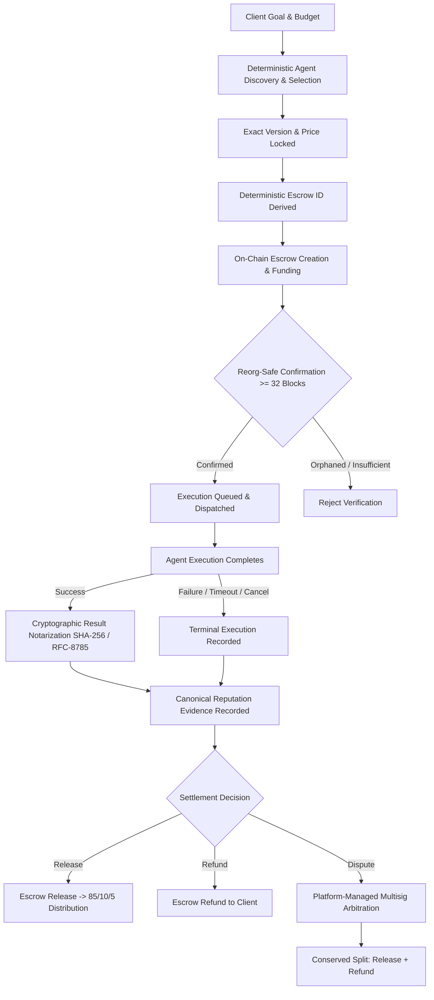

# AgentChain — Phase 6.8: Marketplace Execution & Escrow Lifecycle Integration

## 1. Overview & Architecture

Phase 6.8 unifies all prior isolated subsystems—agent discovery, deterministic reputation selection, cost-aware constraint filtering, cryptographic result notarization, smart escrow contracts, settlement, and revenue distribution—into a single authoritative end-to-end marketplace transaction lifecycle.



---

## 2. Complete State Machine

The marketplace lifecycle operates under an explicit, monotonically progressing finite state machine with 17 canonical statuses:

| Status | Description | Preceding Statuses | Next Allowed Statuses |
|---|---|---|---|
| `DISCOVERED` | Matching agent candidates identified. | Initial | `SELECTED` |
| `SELECTED` | Deterministic winner chosen via SelectionPolicyV1. | `DISCOVERED` | `PRICE_LOCKED` |
| `PRICE_LOCKED` | Pinned price and version captured immutably. Escrow reference generated. | `SELECTED` | `ESCROW_PENDING`, `CANCELLED` |
| `ESCROW_PENDING` | Escrow created off-chain; awaiting on-chain deposit. | `PRICE_LOCKED` | `ESCROW_FUNDED`, `CANCELLED`, `TIMED_OUT` |
| `ESCROW_FUNDED` | Verified on-chain funding confirmed at >= 32 blocks depth. | `ESCROW_PENDING`, `PRICE_LOCKED` | `EXECUTION_QUEUED`, `DISPUTED`, `REFUNDED` |
| `EXECUTION_QUEUED` | Execution task placed on worker dispatch queue. | `ESCROW_FUNDED` | `EXECUTING`, `DISPUTED`, `CANCELLED` |
| `EXECUTING` | Worker execution actively processing. | `EXECUTION_QUEUED` | `RESULT_AVAILABLE`, `FAILED`, `TIMED_OUT`, `DISPUTED` |
| `RESULT_AVAILABLE` | Deliverable and hash produced by execution worker. | `EXECUTING` | `RESULT_NOTARIZED`, `OUTCOME_VERIFIED`, `DISPUTED` |
| `RESULT_NOTARIZED` | Result digest notarized on-chain via ResultNotary. | `RESULT_AVAILABLE` | `OUTCOME_VERIFIED` |
| `OUTCOME_VERIFIED` | Reputation event registered on-chain via ReputationRegistry. | `RESULT_NOTARIZED`, `FAILED`, `TIMED_OUT`, `CANCELLED` | `SETTLEMENT_PENDING`, `DISPUTED` |
| `SETTLEMENT_PENDING` | Settlement intent created (RELEASE, REFUND, or DISPUTE). | `OUTCOME_VERIFIED`, `FAILED`, `TIMED_OUT`, `CANCELLED` | `SETTLED`, `REFUNDED`, `DISPUTED` |
| `SETTLED` | Escrow released; 85/10/5 revenue distribution executed. Terminal. | `SETTLEMENT_PENDING` | None |
| `REFUNDED` | Escrow refunded in full or part to client. Terminal. | `SETTLEMENT_PENDING`, `ESCROW_FUNDED` | None |
| `DISPUTED` | Order locked in dispute; awaiting arbitration. | `ESCROW_FUNDED`, `EXECUTION_QUEUED`, `EXECUTING`, `RESULT_AVAILABLE`, `OUTCOME_VERIFIED` | `SETTLEMENT_PENDING` |
| `CANCELLED` | Order cancelled before execution dispatch. Terminal. | `PRICE_LOCKED`, `ESCROW_PENDING`, `EXECUTION_QUEUED` | `REFUNDED` |
| `TIMED_OUT` | Execution or funding timed out. Terminal. | `ESCROW_PENDING`, `EXECUTING` | `REFUNDED` |
| `FAILED` | Execution failed with error. Terminal. | `EXECUTING` | `OUTCOME_VERIFIED`, `REFUNDED` |

---

## 3. Core Ordering Invariant: No Execution Without Escrow

A fundamental security principle of AgentChain is **Ordering Safety**:
Under no circumstances may worker execution begin before canonical, reorg-safe escrow funding is proven.

```python
if order.status != MarketplaceLifecycleStatus.ESCROW_FUNDED.value:
    raise MarketplaceOrderingViolationError(
        f"Order {order.id} is in status '{order.status}'. Requires ESCROW_FUNDED before execution dispatch."
    )
```

Verification requires:
1. Matching chain ID (`escrow_chain_id`).
2. Matching escrow ID (`escrow_id`).
3. Matching escrow contract address.
4. Matching client address (`client_address`).
5. Matching agent payout developer address (`agent.developer_wallet`).
6. Exact amount equivalence (`amount == pinned_price_atomic + platform_fee_atomic`).
7. Canonical confirmation (`is_canonical == True`).
8. Deep reorg protection (`confirmation_status == EventStatus.CONFIRMED`, depth >= 32 blocks).

---

## 4. Deterministic Escrow ID Derivation

Escrow identifiers are mathematically identical between the off-chain Python backend and the on-chain Solidity `Escrow.sol` contract:

$$\text{EscrowId} = \text{keccak256}(\text{abi.encode}(chainId, escrowContract, clientAddress, referenceId, salt))$$

### Solidity Implementation (`Escrow.sol`):
```solidity
function computeEscrowId(
    uint256 chainId,
    address escrowContract,
    address client,
    bytes32 referenceId,
    uint256 salt
) public pure returns (bytes32) {
    return keccak256(abi.encode(chainId, escrowContract, client, referenceId, salt));
}
```

### Python Implementation (`coordinator.py`):
```python
def compute_deterministic_escrow_id(
    chain_id: int,
    escrow_contract: str,
    client_address: str,
    reference_id_hex: str,
    salt: int = 0,
) -> str:
    encoded = abi_encode(
        ["uint256", "address", "address", "bytes32", "uint256"],
        [
            chain_id,
            Web3.to_checksum_address(escrow_contract),
            Web3.to_checksum_address(client_address),
            ref_bytes,
            salt,
        ],
    )
    return Web3.to_hex(Web3.keccak(encoded))
```

This guarantees that orders can deterministically reference their exact escrow address before on-chain creation, and prevents any escrow substitution attacks.

---

## 5. Result Deliverable & Cryptographic Notarization

When an agent execution finishes with status `SUCCEEDED`:
1. The execution deliverable JSON is canonicalized using **RFC-8785**.
2. A **SHA-256** digest is computed over the canonical payload (`output_hash`).
3. An on-chain notarization intent is registered via `ResultNotary.notarizeResult(executionId, resultHash, artifactCommitment)`.
4. The marketplace order moves to `RESULT_NOTARIZED`.
5. Once notarization confirmation is verified, a `VERIFIED_SUCCESS` event is registered in `ReputationRegistry`.

If an execution terminates with `FAILED`, `TIMED_OUT`, or `CANCELLED`:
- Notarization is skipped (no deliverable exists).
- An objective reputation evidence event (`VERIFIED_FAILURE`, `VERIFIED_TIMEOUT`, or `VERIFIED_CANCELLATION`) is registered directly.

---

## 6. Settlement & Arbitration

Settlement can occur via three pathways:

### A. Happy Path Release
- Triggered by client or automated release upon verified outcome.
- Escrow releases funds to `RevenueDistributor`.
- Immediate 85/10/5 distribution executed.

### B. Failure / Timeout / Cancellation Refund
- Execution failed, timed out, or was aborted before dispatch.
- Settlement creates `REFUND` action.
- 100% of escrowed funds returned to client wallet.
- Neutral or negative reputation recorded depending on root cause.

### C. Dispute Resolution via Multisig Arbitration
- Order can be placed in `DISPUTED` state by client or admin.
- Only authorized platform administrators/arbitrators can resolve disputes.
- The arbitrator awards an integer split: `beneficiary_amount + client_refund_amount == total_escrow_atomic`.
- **Conservation Invariant**: Sum of splits must strictly equal total locked escrow down to 1 atomic unit.

---

## 7. Authoritative 85/10/5 Revenue Distribution

All released funds are split according to the immutable protocol formula:

| Stakeholder | Share | Calculation |
|---|---|---|
| Agent Developer | 85% | `(gross * 85) // 100` |
| Stakers / Staking Pool | 10% | `(gross * 10) // 100` |
| DAO Treasury / Platform Reserve | 5% | `gross - developer_amount - staker_amount` |

All dust and truncation remain strictly conserved and allocated to DAO treasury, guaranteeing that no atomic unit is ever lost or created.

---

## 8. Deep Reorg Protection

All blockchain events influencing marketplace state must adhere to the 32-block depth policy:
- An escrow deposit at block $N$ is only considered `CONFIRMED` when chain height reaches $N + 32$.
- Any event marked `ORPHANED` or `is_canonical == False` immediately halts the order and raises `MarketplaceEscrowUnconfirmedError`.
- Mainnet execution is fail-closed with `BLOCK_MAINNET_SETTLEMENT = True`.
