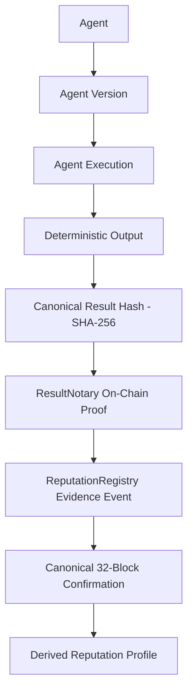

# AgentChain Verified Reputation Foundation (Phase 6.4)

> **Architectural Policy Declaration**:
> *"This phase establishes verified reputation evidence, not a subjective reputation score."*
>
> AgentChain strictly rejects arbitrary user-submitted ratings, self-reported reputation, unverifiable execution claims, mutable client-controlled scores, or speculative token economics. Every reputation event must be backed by an immutable cryptographic proof anchored on-chain.

---

## 1. Authoritative Evidence Chain

The reputation evidence layer enforces a closed, cryptographically verifiable evidence chain:



1. **Agent (`Agent`)**: Immutable identity of the registered agent.
2. **Agent Version (`AgentVersion`)**: Historical version manifest and schema identity. Reputation is never silently conflated or transferred between versions.
3. **Agent Execution (`AgentExecution`)**: Terminal execution record with immutable inputs and outputs.
4. **Canonical Result Hash**: SHA-256 digest computed across deterministic output data formatted under RFC 8785 canonical JSON serialization.
5. **ResultNotary Proof (`ResultNotary.sol`)**: Cryptographic anchor on-chain verifying `verifyProof(executionId, resultHash) == true`.
6. **Reputation Event (`ReputationRegistry.sol`)**: Immutable on-chain log emitted by the authorized relayer with objective classification.
7. **Canonical Confirmation**: Verified at depth >= 32 blocks (or 1 block on local Anvil) with reorg-safe tracking.
8. **Reputation Profile (`ReputationProfile`)**: Off-chain derived projection aggregating objective counts solely from canonical events.

---

## 2. Objective Outcome Classification

To prevent business-policy invention and maintain strict evidentiary integrity, the foundation only supports objective, provable execution outcome categories:

| Outcome Type | Description | ResultNotary Proof Required? | Evidentiary Basis |
| :--- | :--- | :--- | :--- |
| `VERIFIED_SUCCESS` | Execution completed with verified deterministic output | **YES (Mandatory)** | On-chain `ResultNotary.verifyProof` must return `true` with matching hash |
| `VERIFIED_FAILURE` | Execution reached terminal error state | Optional (if output exists) | Execution engine failed state record |
| `VERIFIED_TIMEOUT` | Execution timed out before terminal completion | No | Deterministic scheduler deadline breach |
| `VERIFIED_CANCELLATION` | Execution cancelled by client or system | No | Explicit cancellation request prior to completion |

### Non-Attribution Principles
- Client cancellation does **NOT** automatically imply malicious agent behavior or negative scoring.
- Timeout does **NOT** automatically imply developer negligence; it reflects an objective SLA breach.
- No weighting, penalties, bonuses, or decay algorithms are applied in this phase.

---

## 3. Cryptographic Binding & ResultNotary Dependency

The `ReputationRegistry.sol` contract is cryptographically linked to the authorized `ResultNotary.sol` contract deployed on the target chain.

```solidity
if (outcomeType == OutcomeType.VERIFIED_SUCCESS) {
    if (resultHash == bytes32(0) || !resultNotary.verifyProof(executionId, resultHash)) {
        revert ResultNotNotarized(executionId, resultHash);
    }
} else if (resultHash != bytes32(0)) {
    if (!resultNotary.verifyProof(executionId, resultHash)) {
        revert ResultNotNotarized(executionId, resultHash);
    }
}
```

- An execution cannot claim `VERIFIED_SUCCESS` without an already confirmed ResultNotary proof.
- Backend services fail closed: attempts to register reputation for unnotarized or non-canonical executions raise `ResultNotNotarizedError` or `NotarizationNotCanonicalError`.

---

## 4. Smart Contract Architecture (`ReputationRegistry.sol`)

- **Evidence Registry Only**: Holds **ZERO funds**, accepts **NO deposits**, supports **NO transfers**.
- **Role-Based Access Control**: Only accounts with `REPUTATION_ORACLE_ROLE` can invoke `registerReputationEvent`. Unauthorized calls revert with OpenZeppelin `AccessControlUnauthorizedAccount`.
- **Replay Protection**: An execution ID may be registered at most once (`AlreadyRegistered(executionId)`). Conflicting registrations or replay attempts are strictly rejected.
- **Gas Optimized**: Fixed-size `bytes32` identifiers and packed `uint64` timestamps/block numbers ensure minimal bytecode overhead (3,032 bytes runtime size vs 24,576 byte EIP-170 limit).

---

## 5. Event Idempotency & Deterministic Keys

A deterministic reputation key guarantees strict idempotency across duplicate API calls, Redis delivery replays, and re-mining:

```
reputation_key = sha256(
    f"{chain_id}:{agent_id}:{execution_id}:{outcome_type}:{result_hash or 'none'}:{evidence_hash}"
)
```

- **Duplicate Request**: Database query with row lock detects identical `reputation_key` and returns the existing event with `created=False`.
- **Conflicting Request**: Different outcome or result hash for the same execution raises `ConflictingReputationEventError`.
- **PostgreSQL Constraint**: `UniqueConstraint("chain_id", "execution_id", name="uq_reputation_events_chain_exec")`.

---

## 6. Reorg Safety & Projection Rule

### The Core Invariant
**Mutable on-chain aggregate counters MUST NOT be used as the authoritative reputation state.**

If an aggregate counter is incremented on-chain and a 10-block reorg subsequently occurs, the on-chain total is permanently corrupted. Instead:
1. `ReputationRegistry.sol` emits discrete immutable `ReputationEventRegistered` events.
2. The indexer tracks block canonicality and confirmation depth (32-block authoritative policy).
3. If an event or its underlying ResultNotary proof is orphaned or reorged:
   - Event status transitions to `REORGED` (`is_canonical = False`).
   - `ReputationProjector` recalculates `ReputationProfile` aggregating **ONLY** canonical events.
   - Reorged events are completely excluded from the success rate and total execution count.

---

## 7. Derived Reputation Profile & Mathematical Formula

The `ReputationProfile` model exposes strictly objective counters:

```python
class ReputationProfile(Base):
    total_verified_executions: int
    verified_successes: int
    verified_failures: int
    verified_timeouts: int
    verified_cancellations: int
    canonical_event_count: int
    success_rate: Decimal | None
```

### Success Rate Definition
$$\text{success\_rate} = \frac{\text{verified\_successes}}{\text{total\_verified\_executions}}$$

- **Denominator**: $\text{total\_verified\_executions} = \text{verified\_successes} + \text{verified\_failures} + \text{verified\_timeouts} + \text{verified\_cancellations}$
- If $\text{total\_verified\_executions} == 0$, $\text{success\_rate} = \text{None}$ (strictly undefined, avoiding arbitrary 0.0 or 1.0 assumptions).
- Calculated with 4-decimal precision (`Numeric(5, 4)`).

---

## 8. Verification API

The backend exposes cryptographic verification endpoints (`GET /api/v1/reputation/verify/{reputation_event_id}`):

```json
{
  "reputation_event_id": "98759985-39b2-4ecc-80b6-d598262cc1ee",
  "is_verified": true,
  "verification_status": "CONFIRMED",
  "agent_id": "e2293444-ea66-4100-b605-64e031023a8e",
  "agent_version_id": "0df00685-618d-4f36-b6e5-eb6520b78df0",
  "execution_id": "cca6aa07-964b-48e6-97a1-bb7e2b03eec1",
  "outcome_type": "VERIFIED_SUCCESS",
  "result_hash": "e117d0ab49c9759393b24a62d0ae30b4eea1186c0f910bfe69b7f1f82deed6fd",
  "has_valid_notarization": true,
  "notarization_status": "CONFIRMED",
  "chain_id": 31337,
  "contract_address": "0x01c1def3b91672704716159c9041aeca392ddffb",
  "transaction_hash": "0x4e7b8...",
  "confirmations": 32,
  "confirmations_required": 1,
  "is_canonical": true
}
```

The verification status is `CONFIRMED` only when both ResultNotary and ReputationRegistry proofs are canonical, correctly attributed, and satisfy required confirmation depth.

---

## 9. Security Boundary & Hard-Blocks

1. **Base Mainnet Safety**: `allow_transactions = False` strictly enforced for Chain ID 8453 across API, service layer, and relayer.
2. **Fail-Closed Operations**: Attempts to register reputation without a terminal execution or without verified notarization raise deterministic domain exceptions.
3. **No Direct Submission by EOAs**: Reputation creation endpoints require authenticated backend or operator access. Users cannot submit arbitrary scores.
4. **Immutability of Executions**: Under all failure or reorg conditions, `AgentExecution.output_hash` and status are strictly read-only and immutable.
